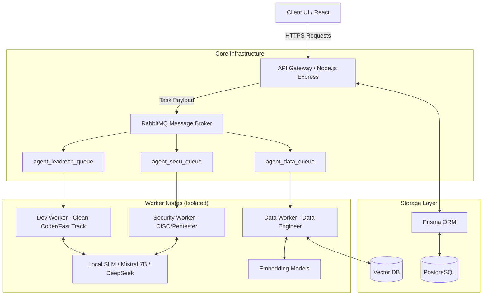

# Aïna Software Factory Architecture

## 1. High-Level Vision
The Aïna Software Factory is an asynchronous, multi-tenant "Digital Labor" platform. It shifts the paradigm from "chatting with an AI Bot" to "delegating tasks to a secure, specialized team of AI workers."

## 2. Component Diagram

## 3. Key Architectural Decisions (ADRs)

### ADR 1: Asynchronous Execution (RabbitMQ)
- **Problem**: Code generation and security auditing take time. Standard HTTP requests (e.g., 30s timeout) will drop before the AI finishes writing a 500-line secure script.
- **Solution**: We implemented RabbitMQ. The API Gateway instantly returns a `202 Accepted` with a `taskId`. The heavy lifting is routed to specific queues. Clients poll or receive SSE/WebSockets for completion.
- **Benefit**: Infinite scaling, zero timeout errors, fault-tolerant.

### ADR 2: Frugal Engineering & SLMs
- **Problem**: Proprietary huge models (GPT-4) cost hundreds of euros per week in a high-volume factory scenario.
- **Solution**: 80% of tasks (refactoring, basic unit tests, formatting) are routed to Small Language Models (SLMs) running locally or on cheap VPS infrastructure.
- **Benefit**: Massive cost reduction, data privacy guaranteed.

### ADR 3: Defense in Depth (Worker Isolation)
- **Problem**: Executing AI-generated code is extremely dangerous. It creates immediate Remote Code Execution (RCE) vectors.
- **Solution**: The `devWorker` executes code in a strictly isolated sandbox (using `vm2` or Docker Drop-Capabilities), completely disconnected from the Host OS and the RabbitMQ broker. User inputs are *never* interpolated directly into strings.
- **Benefit**: Halts Path Traversal and RCE at the worker boundary.
